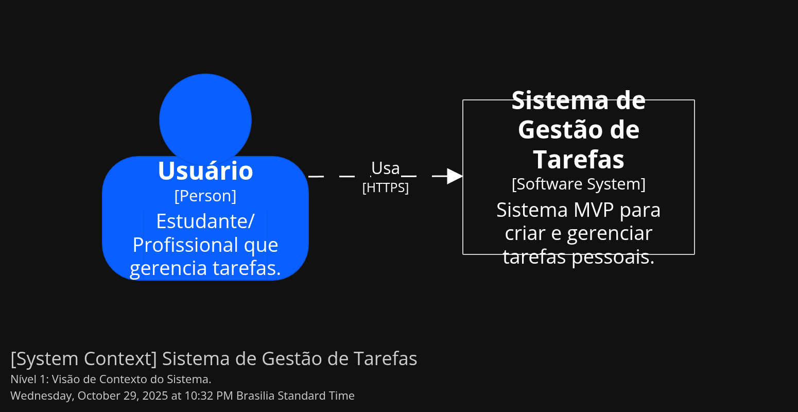
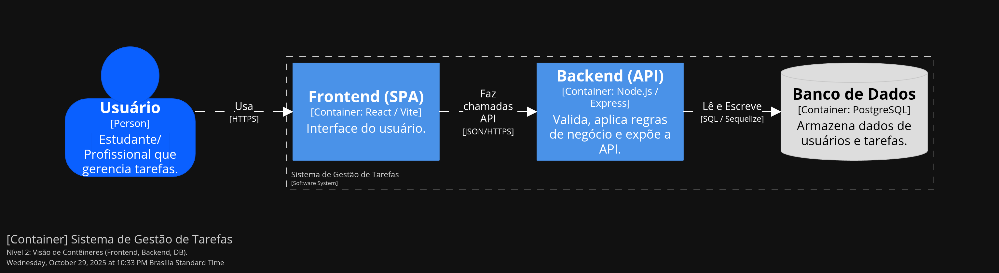
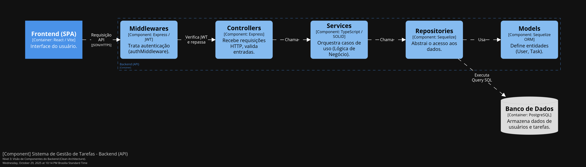

# Task Management System - MVP

A full-stack task management application built with Node.js, Express, TypeScript, React, and PostgreSQL following Clean Architecture principles.

## Project Structure

```
.
├── backend/          # Backend API (Node.js + Express + TypeScript)
│   ├── src/
│   │   ├── config/       # Database configuration
│   │   ├── models/       # Sequelize models (User, Task)
│   │   ├── repositories/ # Data access layer
│   │   ├── services/     # Business logic layer
│   │   ├── controllers/  # API controllers
│   │   ├── routes/       # Express routes
│   │   ├── middlewares/  # Auth & error handling
│   │   └── errors/       # Custom error classes
│   └── package.json
│
├── frontend/         # Frontend SPA (React + TypeScript + Vite)
│   ├── src/
│   │   ├── components/   # React components
│   │   ├── contexts/     # React contexts (Auth)
│   │   ├── pages/        # Page components
│   │   ├── services/     # API services
│   │   └── App.tsx
│   └── package.json
│
└── README.md
```

## Features

### Authentication
- ✅ User registration (HU1)
- ✅ User login with JWT (HU2)
- ✅ Password hashing with bcrypt
- ✅ Protected routes with middleware

### Task Management
- ✅ Create tasks (HU3)
- ✅ Edit tasks (HU4)
- ✅ Delete tasks (HU5)
- ✅ List tasks (HU6)
- ✅ Mark tasks as completed (HU7)
- ✅ Authorization checks (users can only manage their own tasks)

### Testing
- ✅ Unit tests for Services (AuthService, TaskService)
- ✅ Integration tests for Controllers (TaskController)
- ✅ Jest + Supertest

## Tech Stack

### Backend
- **Runtime**: Node.js
- **Framework**: Express
- **Language**: TypeScript
- **Database**: PostgreSQL
- **ORM**: Sequelize
- **Authentication**: JWT (jsonwebtoken)
- **Validation**: express-validator
- **Testing**: Jest, Supertest, ts-jest

### Frontend
- **Framework**: React 18
- **Language**: TypeScript
- **Build Tool**: Vite
- **Routing**: React Router v6
- **HTTP Client**: Axios
- **State Management**: React Context API

## Prerequisites

- Node.js (v18 or higher)
- PostgreSQL (v12 or higher)
- npm or yarn

## Setup Instructions

### 1. Database Setup

Create a PostgreSQL database:

```bash
psql -U postgres
CREATE DATABASE task_management_dev;
\q
```

Or use your preferred PostgreSQL client.

### 2. Backend Setup

```bash
# Navigate to backend directory
cd backend

# Install dependencies
npm install

# Create .env file
cp .env.example .env

# Edit .env with your database credentials
# DB_HOST=127.0.0.1
# DB_PORT=5432
# DB_USER=postgres
# DB_PASS=your_password
# DB_NAME=task_management_dev
# JWT_SECRET=your-secret-key
# PORT=3001

# Run database migrations (create tables)
npm run db:migrate

# Start development server
npm run dev
```

The backend will run on `http://localhost:3001`

### 3. Frontend Setup

```bash
# Navigate to frontend directory (in a new terminal)
cd frontend

# Install dependencies
npm install

# Start development server
npm run dev
```

The frontend will run on `http://localhost:3000`

## Running Tests

### Backend Tests

```bash
cd backend

# Run all tests
npm test

# Run tests in watch mode
npm run test:watch

# Run tests with coverage
npm run test:coverage
```

## API Endpoints

### Authentication

- `POST /api/auth/register` - Register a new user
  ```json
  {
    "name": "John Doe",
    "email": "john@example.com",
    "password": "password123"
  }
  ```

- `POST /api/auth/login` - Login user
  ```json
  {
    "email": "john@example.com",
    "password": "password123"
  }
  ```

### Tasks (Protected)

All task endpoints require `Authorization: Bearer <token>` header.

- `GET /api/tasks` - Get all user's tasks
- `POST /api/tasks` - Create a new task
  ```json
  {
    "title": "My Task",
    "description": "Task description",
    "priority": "high"
  }
  ```
- `PUT /api/tasks/:id` - Update a task
- `PATCH /api/tasks/:id/complete` - Mark task as completed
- `DELETE /api/tasks/:id` - Delete a task

## Database Schema

### Users Table
```sql
CREATE TABLE "Users" (
  "id" SERIAL PRIMARY KEY,
  "name" VARCHAR(255) NOT NULL,
  "email" VARCHAR(255) NOT NULL UNIQUE,
  "password_hash" VARCHAR(255) NOT NULL,
  "created_at" TIMESTAMPTZ NOT NULL DEFAULT NOW(),
  "updated_at" TIMESTAMPTZ NOT NULL DEFAULT NOW()
);
```

### Tasks Table
```sql
CREATE TABLE "Tasks" (
  "id" SERIAL PRIMARY KEY,
  "user_id" INTEGER NOT NULL REFERENCES "Users"("id") ON DELETE CASCADE,
  "title" VARCHAR(255) NOT NULL,
  "description" TEXT,
  "status" VARCHAR(50) NOT NULL DEFAULT 'pending',
  "priority" VARCHAR(50),
  "due_date" TIMESTAMPTZ,
  "created_at" TIMESTAMPTZ NOT NULL DEFAULT NOW(),
  "updated_at" TIMESTAMPTZ NOT NULL DEFAULT NOW()
);
CREATE INDEX "idx_tasks_user_id" ON "Tasks"("user_id");
```

## Architecture (C4 Model)

This project follows **Clean Architecture** principles, implemented as an N-Layer architecture to ensure a strong separation of concerns and dependency inversion.

The architecture is documented below using the C4 model.

### Level 1: System Context

This C4 Level 1 diagram illustrates the highest-level interaction with the system.

**[System Context] Task Management System**

* **User (Person):** The primary actor, "Student/Professional managing tasks".
* **Task Management System (Software System):** The system itself, "MVP system to create and manage personal tasks".
* **Interaction:** The "User" "Uses" the "Task Management System" via [HTTPS].

### Level 2: Container

This C4 Level 2 diagram details the main deployable containers within the "Task Management System".

**[Container] Task Management System**

* **User (Person):** Initiates interaction by "Using" the Frontend via [HTTPS].
* **Frontend (SPA) (Container: React / Vite):** The user interface. "Makes API calls" to the Backend via [JSON/HTTPS].
* **Backend (API) (Container: Node.js / Express):** Validates, applies business rules, and exposes the API. "Reads and Writes" to the database via [SQL / Sequelize].
* **Database (Container: PostgreSQL):** Stores user and task data.

### Level 3: Component (Backend)

This C4 Level 3 diagram details the internal component architecture of the "Backend (API)" container.

**[Component] Task Management System - Backend (API)**

* The **Frontend (SPA)** sends an "API Request" [JSON].
* **Middlewares (Component: Express / JWT):** Receives the request and handles authentication.
* **Controllers (Component: Express):** Receives the verified request, validates HTTP inputs.
* **Services (Component: TypeScript / SOLID):** Called by the Controller to orchestrate use cases and business logic.
* **Repositories (Component: Sequelize (ORM)):** Called by the Service to abstract data access.
* **Models (Component: Sequelize (ORM)):** Used by Repositories to define entities (User, Task).
* **Repositories** execute the "SQL Query" on the **Database**.

### Key Design Decisions

- **Separation of Concerns**: Each layer has a single responsibility
- **Dependency Inversion**: Higher layers don't depend on lower layers
- **Authorization**: Enforced at the Service layer (not just middleware)
- **Error Handling**: Custom error classes with centralized error handler
- **JWT Authentication**: Stateless authentication with Bearer tokens
- **Input Validation**: Using express-validator at the Controller layer

## Usage

1. Open `http://localhost:3000` in your browser
2. Register a new account
3. Login with your credentials
4. Create, view, update, and delete tasks
5. Mark tasks as completed
6. Logout when done

## Production Build

### Backend

```bash
cd backend
npm run build
npm start
```

### Frontend

```bash
cd frontend
npm run build
# Serve the dist/ folder with your preferred static server
```

## License

This is an educational project for UTFPR Software Engineering course.

## Authors

- 7th-semester Software Engineering student (UTFPR)
