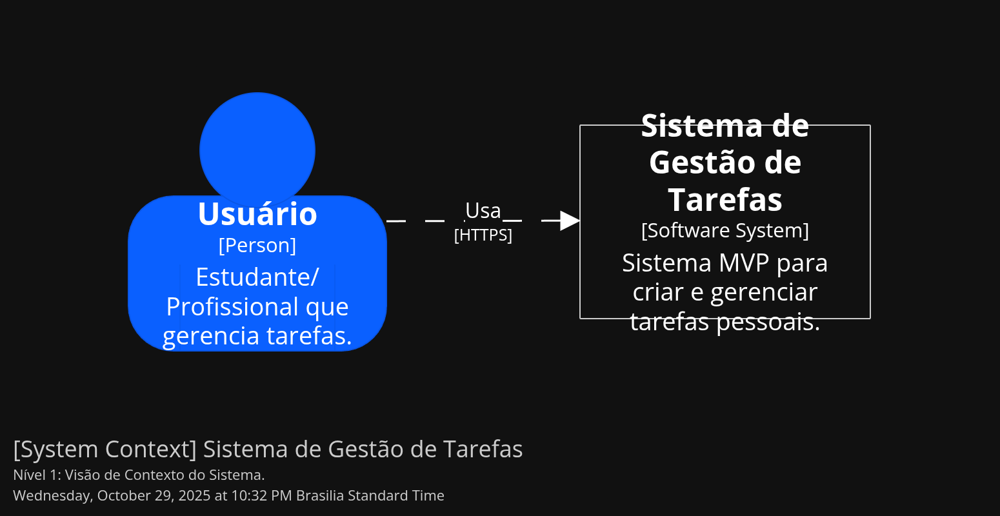
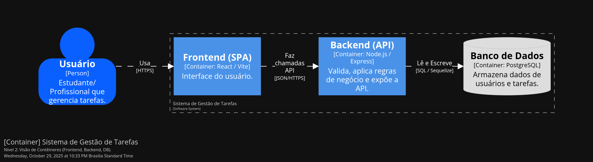
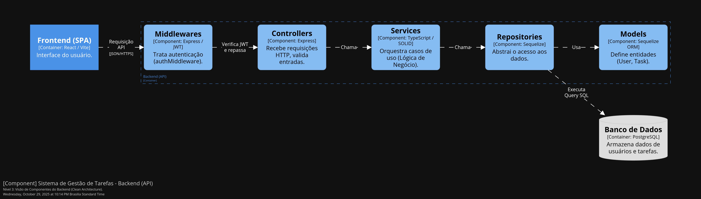

<p align="center"></p>

Uma aplicação full-stack de gerenciamento de tarefas implementando Clean Architecture com Controle de Acesso Baseado em Papel.

## 🚀 Início Rápido (Docker)

```bash
# Clonar e iniciar
git clone https://github.com/oguarni/status-point.git
cd status-point
docker compose up

# Acessar a aplicação
# Frontend: http://localhost:3000
# Backend API: http://localhost:3001
```

### Contas de Teste

Para criar as contas de demonstração no banco de dados, execute:

```bash
docker compose exec backend npm run db:seed:all
```

Após executar o seeder, você poderá fazer login com as seguintes credenciais:

| Papel | Email | Senha |
|-------|-------|-------|
| admin | admin@taskmanager.com | admin123 |
| gestor | gestor@taskmanager.com | gestor123 |
| colaborador | colaborador@taskmanager.com | colaborador123 |

## 📋 Funcionalidades

### Funcionalidade Principal
- ✅ Autenticação de usuário (JWT + bcrypt)
- ✅ Controle de acesso baseado em papel (admin, gestor, colaborador)
- ✅ Operações CRUD de tarefas com autorização
- ✅ Gerenciamento de projetos
- ✅ Comentários e anexos de tarefas
- ✅ Rastreamento de histórico de tarefas
- ✅ Visualização de quadro Kanban
- ✅ **Internacionalização (i18n)** - Português-BR (padrão) e suporte a Inglês com seletor dropdown

### Destaques Técnicos
- ✅ Clean Architecture com princípios SOLID
- ✅ Padrões de Domain-Driven Design
- ✅ 100% de cobertura de testes na camada de Services
- ✅ Docker Compose com hot-reload
- ✅ Documentação abrangente de API
- ✅ Suporte multi-idioma (react-i18next) - Português-BR padrão

## 🛠️ Stack Tecnológica

**Backend:** Node.js, Express, TypeScript, PostgreSQL, Sequelize
**Frontend:** React 18, TypeScript, Vite, React Router v6
**DevOps:** Docker, Docker Compose
**Testes:** Jest, Supertest

## 📁 Estrutura do Projeto

```
.
├── backend/              # API Node.js + Express
│   ├── src/
│   │   ├── domain/      # Entidades de negócio
│   │   ├── usecases/    # Lógica da aplicação
│   │   ├── services/    # Lógica de negócio (100% cobertura)
│   │   ├── repositories/# Camada de acesso a dados
│   │   ├── controllers/ # Endpoints da API
│   │   ├── mappers/     # Conversão ORM ↔ Domain
│   │   └── models/      # ORM Sequelize
│   └── scripts/         # Seeding & testes do banco de dados
│
├── frontend/            # SPA React
│   └── src/
│       ├── pages/       # Componentes de página
│       ├── components/  # Componentes reutilizáveis
│       ├── contexts/    # Contextos React
│       └── services/    # Clientes API
│
├── docs/                # Diagramas de arquitetura (C4)
├── docker-compose.yml   # Orquestração Docker
└── CLAUDE.md           # Guia abrangente para desenvolvedores
```

## 🏗️ Arquitetura

Este projeto segue **Clean Architecture** com 4 camadas:

1. **Camada de Domínio** - Entidades de negócio puras (Task, User, Project)
2. **Camada de Casos de Uso** - Regras de negócio específicas da aplicação
3. **Adaptadores de Interface** - Controllers, repositories, mappers
4. **Infraestrutura** - Implementações de framework (Express, Sequelize)

### Diagramas de Arquitetura C4

Diagramas de arquitetura detalhados estão disponíveis (Mermaid):
- [System Context Diagram](./docs/diagrams/C1_SystemContext.md)
- [Container Diagram](./docs/diagrams/C2_Container.md)
- [Backend Component Diagram](./docs/diagrams/C3_Component_Backend.md)

#### System Context Diagram
<p align="center"></p>

#### Container Diagram
<p align="center"></p>

#### Backend Component Diagram
<p align="center"></p>

## 🧪 Testes

```bash
cd backend

# Executar todos os testes
npm test

# Modo watch
npm run test:watch

# Relatório de cobertura
npm run test:coverage
```

**Cobertura Atual:** 100% na camada de Services

## 📚 Endpoints da API

### Autenticação
- `POST /api/auth/register` - Registrar novo usuário
- `POST /api/auth/login` - Login

### Tarefas (Protegido)
- `GET /api/tasks` - Listar tarefas do usuário
- `POST /api/tasks` - Criar tarefa
- `PUT /api/tasks/:id` - Atualizar tarefa
- `PATCH /api/tasks/:id/complete` - Marcar como concluída
- `DELETE /api/tasks/:id` - Deletar tarefa

### Projetos (Protegido)
- `GET /api/projects` - Listar projetos
- `POST /api/projects` - Criar projeto (apenas admin/gestor)
- `PUT /api/projects/:id` - Atualizar projeto
- `DELETE /api/projects/:id` - Deletar projeto

## ⚙️ Configuração Manual (Sem Docker)

<details>
<summary>Clique para expandir as instruções de configuração manual</summary>

### Pré-requisitos
- Node.js v18+
- PostgreSQL v12+

### Backend

```bash
cd backend
npm install

# Criar banco de dados
psql -U postgres -c "CREATE DATABASE task_management_dev;"

# Configurar .env
cp .env.example .env
# Edite .env com suas credenciais de banco de dados

# Executar migrations
npm run db:migrate

# Iniciar servidor
npm run dev
```

### Frontend

```bash
cd frontend
npm install
npm run dev
```

</details>

## 📖 Documentação

- **[CLAUDE.md](./CLAUDE.md)** - Guia abrangente para desenvolvedores e assistentes de IA
  - Explicações detalhadas de arquitetura
  - Padrões e convenções de código
  - Estratégias de teste
  - Tarefas e fluxos de trabalho comuns

## 🎓 Contexto Acadêmico

Este projeto foi desenvolvido como trabalho da disciplina de **Arquitetura de Software (AS27S)**, da turma **7ES1**, ofertada pelo Curso de Engenharia de Software da **Universidade Tecnológica Federal do Paraná (UTFPR)**, campus Dois Vizinhos.

**Orientação:** Prof. Dr. Francisco Carlos.

O objetivo principal foi aplicar na prática os conceitos de **Clean Architecture**, **SOLID**, **Domain-Driven Design (DDD)** e **Controle de Acesso Baseado em Papel (RBAC)**.

### Autores

- Aurélio Antonio Brites de Miranda
- Gabriel Felipe Guarnieri

## 📄 Licença

CC BY-NC-SA 4.0 - veja o arquivo [LICENSE](./LICENSE) para detalhes.
